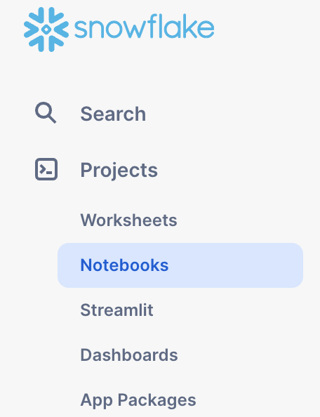
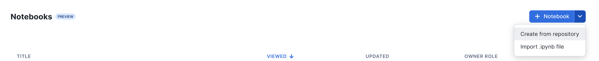
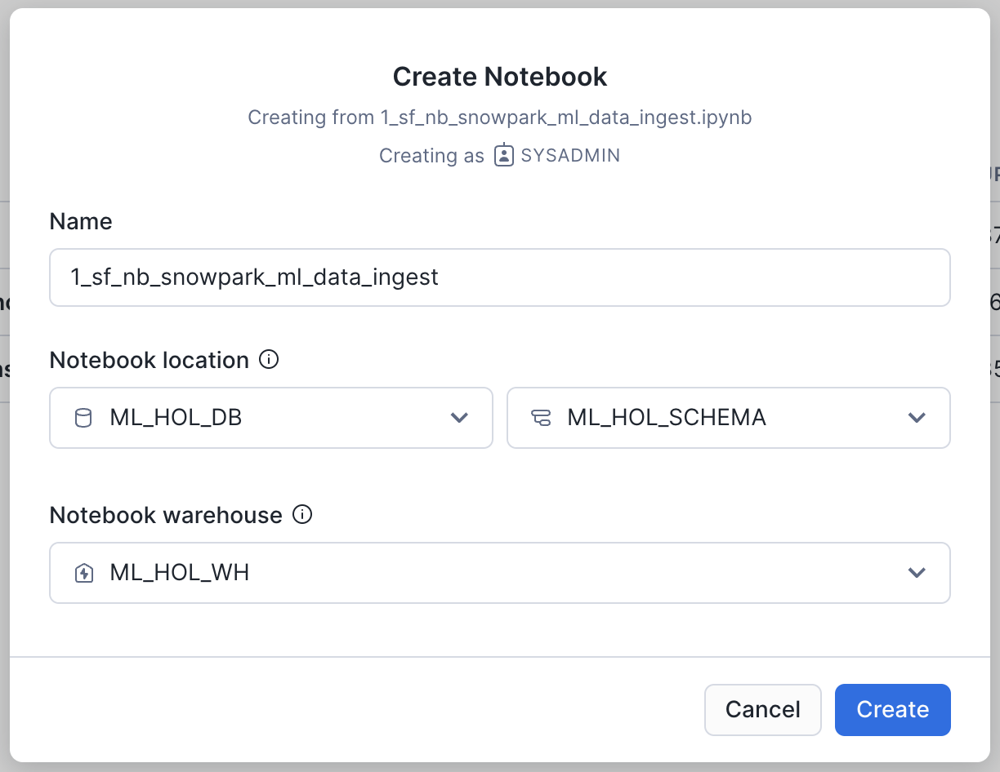
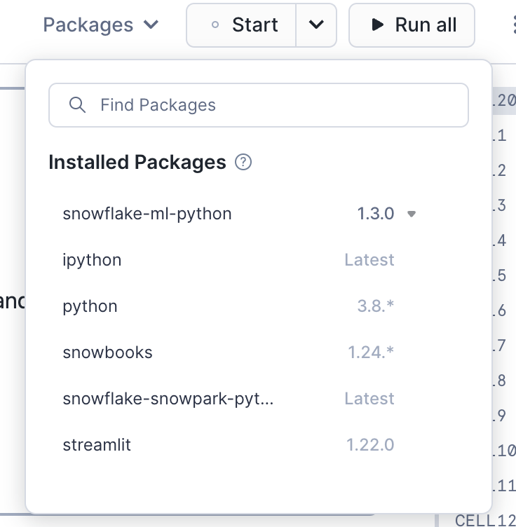

# Intro to Machine Learning with Snowpark ML for Python
## Using [Snowflake Notebooks!](https://docs.snowflake.com/en/LIMITEDACCESS/snowsight-notebooks/ui-snowsight-notebooks-about)

Want to try out the Intro to Machine Learning with Snowpark ML Quickstart using Snowflake's Notebooks in Snowsight? This folder contains three notebooks that are ready-to-use in your Snowflake environment:
- [1_sf_nb_snowpark_ml_data_ingest.ipynb](./1_sf_nb_snowpark_ml_data_ingest.ipynb)
- [2_sf_nb_snowpark_ml_feature_transformations.ipynb](./2_sf_nb_snowpark_ml_feature_transformations.ipynb)
- [3_sf_nb_snowpark_ml_model_training_inference.ipynb](./3_sf_nb_snowpark_ml_model_training_inference.ipynb)

To get started using Snowflake Notebooks, first login to Snowsight and run the following [setup.sql](./setup.sql) in a SQL worksheet (we need  to create the database, warehouse, schema, etc. that we will use for our ML project).
```sql
USE ROLE SYSADMIN;
CREATE OR REPLACE WAREHOUSE ML_HOL_WH; --by default, this creates an XS Standard Warehouse
CREATE OR REPLACE DATABASE ML_HOL_DB;
CREATE OR REPLACE SCHEMA ML_HOL_SCHEMA;
CREATE OR REPLACE STAGE ML_HOL_ASSETS; --to store model assets

-- create csv format
CREATE FILE FORMAT IF NOT EXISTS ML_HOL_DB.ML_HOL_SCHEMA.CSVFORMAT 
    SKIP_HEADER = 1 
    TYPE = 'CSV';

-- create external stage with the csv format to stage the diamonds dataset
CREATE STAGE IF NOT EXISTS ML_HOL_DB.ML_HOL_SCHEMA.DIAMONDS_ASSETS 
    FILE_FORMAT = ML_HOL_DB.ML_HOL_SCHEMA.CSVFORMAT 
    URL = 's3://sfquickstarts/intro-to-machine-learning-with-snowpark-ml-for-python/diamonds.csv';
    -- https://sfquickstarts.s3.us-west-1.amazonaws.com/intro-to-machine-learning-with-snowpark-ml-for-python/diamonds.csv

LS @DIAMONDS_ASSETS;

```

Now, let's create our first Notebook by importing a `.ipynb` file. First, make sure your current role is SYSADMIN. Then, select the Notebooks tab under the Projects drop-down in the left side-bar:



Next, click the gray upload/import .ipynb button, and select [1_sf_nb_snowpark_ml_data_ingest.ipynb](./1_sf_nb_snowpark_ml_data_ingest.ipynb) from your local filesystem:



Leave the populated notebook name as-is (or change it if you'd like!), and make sure that the location is set to `ML_HOL_DB` and `ML_HOL_SCHEMA`. Lastly, make sure the Notebook warehouse is `ML_HOL_WH`, and click Create:



This will create and open the notebook you just uploaded. Follow the instructions at the top of the Notebook to select any necessary packages you might need via the Packages drop-down:



Then, click `Start` and run the Notebook start to finish! Repeat this process with all three Notebooks to see how easy it is to write Python and SQL code in a single, familiar Notebook interface directly in Snowsight!