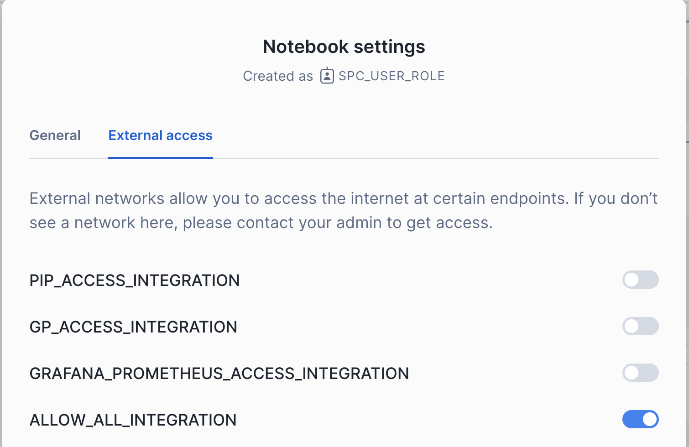

# Getting Started with Notebooks on Container Runtimes

This example notebooks demonstrates how to get started using Snowflake's Container Runtime for Notebooks. It includes the setup, configuration, and execution of a straightforward machine learning training job.

For more info about the Notebooks Container runtime, check out:
- The [public documentation](https://docs.snowflake.com/LIMITEDACCESS/snowsight-notebooks/ui-snowsight-notebooks-runtime)
- An [overview presentation](https://docs.google.com/presentation/d/1pModfkpZuoAsKiYAYfpcO50PxaFB460VCO6qeM_S66s/edit#slide=id.g293d2d1b46a_1_87) of the notebooks container runtime

## Setup

**Note: as of July 15, 2024, the Notebooks Container Runtime is in Private Preview.** Make sure that your account is enabled for this Private Preview if you intend to run this example.

### Step 1 - SQL Setup Script

Run the following SQL code in a Snowflake SQL Worksheet to create the database objects, roles, privileges, and compute pools needed to run this example notebook.

The setup script is to be run by ACCOUNTADMIN. However, a different role needs to be used to create and author notebooks. This role cannot be ACCOUNTADMIN, SECURITYADMIN, or ORGADMIN. In the example, we’re granting privileges to SYSADMIN which will then be used to create notebooks. Please choose a role that has the privilege of creating a table in a schema. 

```sql
------------------
-- DEMO STEP #1 --
------------------
-- General setup
use role accountadmin;
create database public;
create schema notebooks;

grant usage on database public to role sysadmin;
grant usage on schema public.notebooks to role sysadmin;
grant create stage on schema public.notebooks to role sysadmin;
grant create notebook on schema public.notebooks to role sysadmin;
grant create service on schema public.notebooks to role sysadmin;
grant usage on warehouse compute_wh to role sysadmin;

-- Create and grant access to compute pools
CREATE COMPUTE POOL CPU_XS_5_NODES
  MIN_NODES = 1
  MAX_NODES = 5
  INSTANCE_FAMILY = CPU_X64_XS;

CREATE COMPUTE POOL GPU_S_5_NODES
  MIN_NODES = 1
  MAX_NODES = 5
  INSTANCE_FAMILY = GPU_NV_S;

grant usage on compute pool CPU_XS_5_NODES to role sysadmin;
grant usage on compute pool GPU_S_5_NODES to role sysadmin;

-- Create and grant access to EAIs
-- Substep #1: create network rules (these are schema-level objects; end users do not need direct access to the network rules)

create network rule allow_all_rule
  TYPE = 'HOST_PORT'
  MODE= 'EGRESS'
  VALUE_LIST = ('0.0.0.0:443','0.0.0.0:80');

-- Substep #2: create external access integration (these are account-level objects; end users need access to this to access the public internet with endpoints defined in network rules)

CREATE EXTERNAL ACCESS INTEGRATION allow_all_integration
  ALLOWED_NETWORK_RULES = (allow_all_rule)
  ENABLED = true;

CREATE OR REPLACE NETWORK RULE pypi_network_rule
  MODE = EGRESS
  TYPE = HOST_PORT
  VALUE_LIST = ('pypi.org', 'pypi.python.org', 'pythonhosted.org',  'files.pythonhosted.org');

CREATE OR REPLACE EXTERNAL ACCESS INTEGRATION pypi_access_integration
  ALLOWED_NETWORK_RULES = (pypi_network_rule)
  ENABLED = true;

Grant USAGE ON INTEGRATION allow_all_integration to ROLE sysadmin;
Grant USAGE ON INTEGRATION pypi_access_integration to ROLE sysadmin;
```

Additional information about compute pool configurations is available in [the documentation](https://docs.snowflake.com/developer-guide/snowpark-container-services/working-with-compute-pool).

### Step 2 - Upload `diamonds.csv` Data

Next, we will upload the [diamonds.csv](https://github.com/Snowflake-Labs/snowflake-demo-notebooks/tree/main/Getting%20Started%20with%Container%Runtimes/diamonds.csv) dataset included in this git repo.

In Snowsight, navigate to **Data >> Databases** and select the database.schema where the role has privileges to create a table. For example, we'll be using `SYSADMIN` to upload the dataset and create a table out of it in the schema `PUBLIC.NOTEBOOKS`. Select **Create >> Table >> From File >> Standard** in the top right, and upload the `diamonds.csv` dataset.


### Step 3 - Import the `getting_started_with_container_runtimes.ipynb` file and create a notebook

Using the `SYSADMIN` role, navigate to the **Notebooks** page on Snowsight, and select the upload button to `Import .ipynb file`.


Fill out the creation dialog using the schema, warehouse, and compute pool set up in Step #1.


### Step 4 - Attach External Access Integrations (EAIs)

Navigate to the notebook settings via the three dots in the top right hand corner, and select the External Accesses tab. Toggle on the `allow_all_integration` EAI.


### Step 5 - Run the notebook!

You're now ready to run the notebook! Checkout out the Notebook Markdown cells for an explanation of what is happening at each step along the way.

## Additional Resources
- [Documentation](https://docs.snowflake.com/LIMITEDACCESS/snowsight-notebooks/ui-snowsight-notebooks-runtime)
- [YouTube Tutorials](https://www.youtube.com/playlist?list=PLavJpcg8cl1Efw8x_fBKmfA2AMwjUaeBI)
- [GitHub repo](https://github.com/Snowflake-Labs/snowflake-demo-notebooks) of more example notebooks